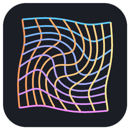

<p align="center"></p>

# ComfyUI Model Bending Agent

[](https://github.com/abuzreq/comfyui-model-bending-agent/actions/workflows/build.yml)
[](https://github.com/abuzreq/comfyui-model-bending-agent/releases/latest)
[](LICENSE)
[](https://huggingface.co/datasets/abuzreq/model-bending-knowledge-base)

An [agent skill](https://agentskills.io) that lets Claude, Codex, Copilot, Cursor, Gemini CLI and other AI agents
explore, steer and explain image and video models by **bending their internal activations** in your own ComfyUI,
with [ComfyUI-Model-Bending](https://github.com/abuzreq/ComfyUI-Model-Bending).

You describe what you are after: *"make the sea stormier but keep the lighthouse"*, *"why does this bend give a
poster look?"*. The agent picks where and when to nudge the model, renders a few versions, checks what was actually
bent, looks at the results, and either keeps going or asks you to choose. It talks in plain words, so you do not need
to know what a UNet is.

## What it can do

- **Three depths:** fast bending with known recipes · activation steering (steering vectors, time-windowed bends,
  conditioning arithmetic) · mechanistic explanation (ablation scans over layer × time, activation footprints,
  evidence-graded write-ups).
- **Three levels of involvement:** it works on its own · it stops after every round so you can choose (in the
  Claude app, on a pick board right in the chat) · it puts interactive boards on your ComfyUI canvas (comparison
  switchboard, slider board, feature-map inspector) and reads your votes, picks and slider moves back.
- **Your picture as a start:** give a picture alongside the prompt, a file on your computer or a version from an
  earlier round, and say how closely to follow it.
- **Image models:** SD1.5, SDXL, Flux and SD3, with measured safe ranges for SD1.5 and SDXL.
- **Video models (experimental):** WAN 2.1 / 2.2, text-to-video and image-to-video. Bends act on the model's
  attention, frame by frame and over time (lag, smear, reverse, a bend that grows over the clip).
- **Bend animations:** a bend rendered in small increments as a looping video.
- **A shared knowledge base:** start from what others found when bending the same model (see
  [below](#the-bend-knowledge-base)), and keep a private record of your own rounds.
- **Reproducible:** every image carries its workflow, and every round is logged with the exact bends, seed and model.

## Before you start

On the computer that runs ComfyUI:

1. **[ComfyUI](https://github.com/comfyanonymous/ComfyUI) 0.18 or newer.** The desktop app or the portable build
   both work. The agent expects it at `http://127.0.0.1:8188` (change it in the settings below).
2. **[ComfyUI-Model-Bending](https://github.com/abuzreq/ComfyUI-Model-Bending) 0.3 or newer.** In ComfyUI open
   *Manager → Custom Nodes Manager*, search for *Model Bending*, install, and restart ComfyUI.
3. **A model.** Tested with SD1.5 (LCM Dreamshaper v7) and SDXL. Flux needs about 12 GB of graphics memory (or a GGUF
   version on smaller cards). For video: WAN 2.1 1.3B (about 8 GB) or the 14B image-to-video model (16 GB or more).
4. *Optional:* **[ComfyUI-Agent-Bridge](https://github.com/abuzreq/ComfyUI-Agent-Bridge)**, from the same Manager
   (*Agent Bridge*). With it the agent can open boards in a new tab of your ComfyUI after you confirm, and receive your
   votes and picks. Without it, boards are saved to your Workflows sidebar.
5. *Optional:* **[ffmpeg](https://ffmpeg.org)** on the PATH, for `.mp4` animations (otherwise `.gif`).

The agent never installs nodes, downloads models or restarts ComfyUI without asking.

## Install

**Which install you need depends on where your agent runs.**

| your agent | what to install |
|---|---|
| **Claude desktop app** (Chat) | the skill **and** the comfyui-bending extension: the app runs skill code in a sandbox that cannot reach your ComfyUI, and the extension does that part on your computer. (claude.ai in a browser cannot run local extensions, so it cannot reach your ComfyUI) |
| **Claude Code**, Codex, Copilot, Cursor, OpenCode, Gemini CLI (agents that run commands on your computer) | the skill only; it reaches ComfyUI with its own scripts. They need [uv](https://docs.astral.sh/uv/) and Python 3.10+ |
| any other MCP client | the MCP server (below) |

### Claude desktop app

1. Download `comfyui-model-bending.zip` and `comfyui-bending.mcpb` from the
   [latest release](https://github.com/abuzreq/comfyui-model-bending-agent/releases/latest).
2. **The skill.** Turn on code execution (*Settings → Capabilities*). Then *Customize → Skills → **+** → Create skill →
   Upload a skill*, and choose the ZIP.
3. **The extension.** Double-click the `.mcpb` file, or install it from *Settings → Extensions*. Claude installs
   Python and everything else it needs. The extension's settings hold your ComfyUI address and the folder where
   workflows and animations are saved.
4. Fully quit Claude (from the system tray or menu bar) and open it again.
5. Start ComfyUI, open a new chat and ask: *"Check my ComfyUI bending setup."*

The in-chat pick board shows in the desktop app's **Code** tab. In the Chat tab some versions of the app do not show
it yet; the agent notices and shows the versions as pictures in the chat instead.

### Claude Code

```
/plugin marketplace add abuzreq/comfyui-model-bending-agent
/plugin install comfyui-model-bending@comfyui-model-bending-agent
```

Or copy `skills/comfyui-model-bending/` into `~/.claude/skills/`.

### Codex, GitHub Copilot, Cursor, OpenCode and other skill-aware agents

Let the [skills CLI](https://github.com/vercel-labs/skills) place it for the agents you use:

```
npx skills add abuzreq/comfyui-model-bending-agent -g
```

Or copy `skills/comfyui-model-bending/` into `~/.agents/skills/` (read by Codex, Cursor and Copilot), or an
agent-specific folder: `~/.codex/skills/`, `~/.copilot/skills/`, `~/.cursor/skills/`.

### Gemini CLI

```
gemini extensions install https://github.com/abuzreq/comfyui-model-bending-agent
```

### Any MCP client (optional for agents with a shell)

The skill's tool server runs through uv, with no paths to set:

```json
{
  "mcpServers": {
    "comfyui-bending": {
      "command": "uvx",
      "args": ["--from", "git+https://github.com/abuzreq/comfyui-model-bending-agent", "comfyui-bending-mcp"],
      "env": { "COMFYUI_URL": "http://127.0.0.1:8188" }
    }
  }
}
```

In one command, for Codex and VS Code:

```
codex mcp add comfyui-bending -- uvx --from git+https://github.com/abuzreq/comfyui-model-bending-agent comfyui-bending-mcp
```

```
code --add-mcp "{\"name\":\"comfyui-bending\",\"command\":\"uvx\",\"args\":[\"--from\",\"git+https://github.com/abuzreq/comfyui-model-bending-agent\",\"comfyui-bending-mcp\"]}"
```

Agents that run commands do not need it. It gives them pictures inline and one tool per step instead of script
calls.

## Try it

- *"Bend my SD1.5 model on 'a lighthouse on a cliff at dusk, oil painting'. Show me three options."*
- *"Start from my painting (`C:\Users\me\Pictures\harbour.png`), keep its composition, and show me three restyles."*
- *"I want more abstract results on SD1.4. What do others' bends suggest?"*
- *"Put a slider board on my canvas so I can tune a rotation on the middle block."*
- *"Why does multiplying the last up-blocks by 1.8 give a poster look? Which layers and timesteps cause it?"*
- *"Make a looping video of the bend I just ran, from 0 to 180 degrees in small steps."*
- *"Bring version B to life with WAN and bend how the video reads the picture."*

At the start it asks, once, how deep to go (fast bending, steering, or explanation), how much to involve you, and
whether to use the knowledge base. Everything it makes is logged in `bending_sessions/<session>/`.

## The bend knowledge base

The [Model Bending Knowledge Base](https://huggingface.co/datasets/abuzreq/model-bending-knowledge-base) is an open
dataset (CC0) of what happens when you bend which part of which model: thousands of bent renders, each next to an
unbent baseline, grouped into "cells" (model family, layer group, operation, amount, step window) with an evidence
grade, plus findings from the paper below.

- **The agent asks first.** At the start of a session it asks whether to begin from the community knowledge base,
  your own earlier sessions, both, or neither. Its suggestions say where each idea comes from and how well tested it
  is ("seen across several prompts and seeds" vs "seen once").
- **Facts are kept apart from interpretation.** A record's facts (recipe, setup, output, measurements) are stored
  apart from captions and tags, and every interpretation names its author: a person, or the AI model that wrote it.
- **Your own rounds stay on your computer.** Each round you judge is added to your local knowledge base. Your prompts
  and input pictures go to a private file, and nothing is uploaded.

### Contribute your findings

The knowledge base grows with every artist who shares what they found. Most of it is SD1.5 so far, so records on
SDXL, Flux, SD3 and WAN video are especially welcome. To contribute:

1. Find your rounds in your local knowledge base: `kb/records/<model family>/session/<record id>/` inside the
   working folder (`~/.comfyui-model-bending/` unless you changed it), with their unbent baselines in `kb/baselines/`.
   Ask the agent to show you which record is which round.
2. Copy the record folders you want to share, **leaving out** `private.json` (your prompt and picture) and
   `sharing.json`. Records name your prompt only by a salted key, so nothing private goes with them.
3. Open a pull request on the dataset that adds them under `records/` (and their baselines under `baselines/`),
   through the Hugging Face web page or `huggingface_hub.upload_folder(..., create_pr=True)`. Records follow the
   dataset's `schema/record.schema.json`; every interpretation names its author, and AI-written ones name their
   model.

PRs are reviewed before merging. Findings from papers or your own studies are welcome too.

## Settings

| variable | default | used for |
|---|---|---|
| `COMFYUI_URL` | `http://127.0.0.1:8188` | where ComfyUI runs |
| `COMFY_BENDING_WORKDIR` | `~/.comfyui-model-bending` | workflows, animations and your knowledge base, when using the MCP server |
| `AGENT_BRIDGE_TOKEN` | read from `ComfyUI/user/agent_bridge/token` | ComfyUI-Agent-Bridge authentication |

In the Claude desktop app, set the first two in the extension's settings.

## Security and privacy

- ComfyUI has no login. Started with `--listen`, anyone on your network can use it; with
  `--enable-cors-header="*"`, any website you visit can call it.
- The agent never installs nodes, downloads models, restarts ComfyUI or deletes outputs without asking, and never
  overwrites your workflows: it writes under `workflows/agent_bending/` and `workflows/agent_bridge/`.
- Canvas sharing (Agent-Bridge) is off by default, and only you can switch it on.
- The Agent-Bridge token is a local secret: the agent reads it from disk and never shows it.
- Pictures you start from are copied into ComfyUI's input folder (`input/agent_bending/`). Nothing is sent anywhere
  else by the skill.

## Contributing

Issues and pull requests are welcome: bug reports, presets for more models, measured safe ranges for new
checkpoints, what you see with real WAN weights, and clearer wording for artists. See
[CONTRIBUTING.md](CONTRIBUTING.md) for the layout, the tests and the few rules the skill keeps.

## Related

- [ComfyUI-Model-Bending](https://github.com/abuzreq/ComfyUI-Model-Bending): the ComfyUI nodes that do the bending.
- [ComfyUI-Agent-Bridge](https://github.com/abuzreq/ComfyUI-Agent-Bridge): proposals, picks and feedback between your
  canvas and an agent.
- [Model Bending Knowledge Base](https://huggingface.co/datasets/abuzreq/model-bending-knowledge-base): the shared
  dataset of bends and their effects.
- [Interactive demo](https://diffusion-bending-demo.netlify.app/) of model bending with pre-computed results.

## Citation

If you use this in research, please cite:

```bibtex
@misc{abuzuraiq2026unboxing,
  title  = {Unboxing Diffusion Models for the Arts: Interactive Model Bending and Practice-Based Explainability},
  author = {Abuzuraiq, Ahmed M. and Pasquier, Philippe},
  year   = {2026},
  eprint = {2607.22428},
  archivePrefix = {arXiv}
}
```

## License

MIT. See [LICENSE](LICENSE). The bundled MCP Apps client in `skills/comfyui-model-bending/scripts/ui/vendor/`
comes unmodified from [modelcontextprotocol/ext-apps](https://github.com/modelcontextprotocol/ext-apps) under its own
license (Apache-2.0 and MIT, in `LICENSE-ext-apps.txt` next to it).
